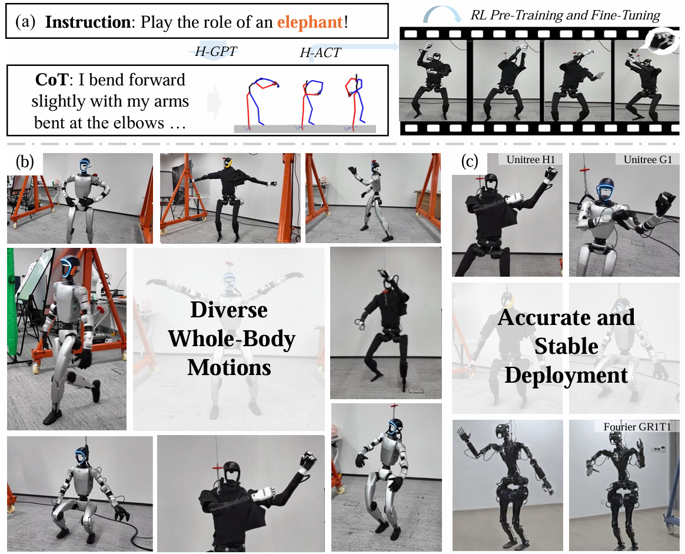

<div align="center">

# FRoM-W1: Towards General Humanoid Whole-Body Control with Language Instructions

  

  The [Humanoid Intelligence Team](https://github.com/humanoidintelligence) from [FudanNLP](https://nlp.fudan.edu.cn/nlpen/main.htm) and [OpenMOSS](https://openmoss.github.io/)

<p align="center">
  <a href="https://openmoss.github.io/FRoM-W1/">
    
  </a>
  <a href="https://arxiv.org/abs/2601.12799">
    
  </a>
  <a href="https://github.com/OpenMOSS/FRoM-W1">
    
  </a>
  <a href="https://huggingface.co/datasets/OpenMOSS-Team/FRoM-W1-Datasets">
    
  </a>
  <a href="https://huggingface.co/OpenMOSS-Team/FRoM-W1">
    
  </a>
  <a href="LICENSE">
    
  </a>
</p>

</div>

## 🔥 Introduction
<div align="center">
  
</div>

> For more information, please refer to our [project page](https://openmoss.github.io/FRoM-W1/) and [technical report](https://arxiv.org/abs/2601.12799).

Humanoid robots are capable of performing various actions such as greeting, dancing and even backflipping. However, these motions are often hard-coded or specifically trained, which limits their versatility. In this work, we present **FRoM-W1** (**F**oundational Humanoid **Ro**bot **M**odel - **W**hole-Body Control, Version **1**), an open-source framework designed to achieve general humanoid whole-body motion control using natural language.

To universally understand natural language and generate corresponding motions, as well as enable various humanoid robots to stably execute these motions in the physical world under gravity, **FRoM-W1** operates in two stages:

**(a) H-GPT**  
Utilizing massive human data, a large-scale language-driven human whole-body motion generation model is trained to generate diverse natural behaviors. We further leverage the Chain-of-Thought technique to improve the model's generalization in instruction understanding.

**(b) H-ACT**  
After retargeting generated human whole-body motions into robot-specific actions, a motion controller that is pretrained and further fine-tuned through reinforcement learning in physical simulation enables humanoid robots to accurately and stably perform corresponding actions. It is then deployed on real robots via a modular sim-to-real module.

We extensively evaluate **FRoM-W1** on Unitree H1 and G1 robots. Results demonstrate superior performance on the HumanML3D-X benchmark for human whole-body motion generation, and our introduced reinforcement learning fine-tuning consistently improves both motion tracking accuracy and task success rates of these humanoid robots. We open-source the entire **FRoM-W1** framework and hope it will advance the development of humanoid intelligence.

## 📑 Roadmap

- [x] 🎉 Release the initial codebase for the **[H-GPT](./H-GPT/README.md)** and **[H-ACT](./H-ACT/README.md)** modules
- [x] 🎉 Release the amazing humanoid-robot deployment framework **[RoboJuDo](https://github.com/HansZ8/RoboJuDo)**
- [x] Release the CoT datasets of the HumanML3D-X and Motion-X benchmarks, and the δHumanML3D-X benchmark
- [x] Release checkpoints for the baseline models, SMPL-X version of T2M, MotionDiffuse, MLD, T2M-GPT
- [x] 🎉 Release the **[Technical Report](https://arxiv.org/abs/2601.12799)** and **[Project Page](https://openmoss.github.io/FRoM-W1/)** of FRoM-W1!
- [ ] More powerful models are working in progress

## 💾 Datasets

Due to license restrictions, we cannot publicly share all of the data. Here are the reference download and processing links for the relevant datasets:

**H-GPT Module**

| **Dataset Name** | **Download Guide** |
|:----------------:|:------------------:|
|    HumanML3D-X   | Please refer to the process in the [Motion-X](https://github.com/IDEA-Research/Motion-X) repo and [this document](./H-GPT/motionx_processing.md) to download and process the corresponding AMASS data. We re-calculate the mean and std for this dataset, and use the original HumanML3D train/dev/test split. The CoT part can be downloaded [here](https://huggingface.co/datasets/OpenMOSS-Team/FRoM-W1-Datasets/tree/main/data).|
|   δHumanML3D-X   | After obtaining the HumanML3D-X data, replace the textual instructions in it with the perturbed versions provided [here](https://huggingface.co/datasets/OpenMOSS-Team/FRoM-W1-Datasets/tree/main/data). |
|     Motion-X     | Please refer to the original [Motion-X](https://github.com/IDEA-Research/Motion-X) repo. We add a Motion-X processing document [HERE](./H-GPT/motionx_processing.md).|

During your development process, you might also need the original HumanML3D and KIT-ML datasets, for example, to reproduce related work or check the accuracy of your code. Here are two links that might speed up this process: [HumanML3D](https://drive.google.com/drive/folders/1OZrTlAGRvLjXhXwnRiOC-oxYry1vf-Uu) / [KIT-ML](https://drive.google.com/drive/folders/1D3bf2G2o4Hv-Ale26YW18r1Wrh7oIAwK).

**H-ACT Module**

| **Dataset Name** | **Download Guide** |
|:----------------:|:------------------:|
|       AMASS      | Please refer to the download and processing procedures for the [AMASS](https://amass.is.tue.mpg.de/index.html) dataset in the [human2humanoid](https://github.com/LeCAR-Lab/human2humanoid?tab=readme-ov-file#amass-dataset-preparation) project. |
|     AMASS-H1     | The retargeted dataset for the Unitree H1 can be obtained from the [link](https://cmu.app.box.com/s/vfi619ox7lwf2hzzi710p3g2l59aeczv) provided by human2humanoid.|
|     AMASS-G1     | We provide a retargeted dataset for the Unitree G1, with the link available [here]().|

## 🧠 Models

To keep the repo organized, we provide a subset of core model checkpoints below. If you require additional model checkpoints, please contact us.

**H-GPT Module**

| **Model Name** | **Download Guide** |
|:--------------:|:------------------:|
|     Eval Model   |    [HuggingFace link](https://huggingface.co/OpenMOSS-Team/FRoM-W1/tree/main/eval), which were trained following the [T2M](https://github.com/EricGuo5513/text-to-motion) pipeline with the SMPL-X format. |
|  Baseline Models |    [HuggingFace link](https://huggingface.co/OpenMOSS-Team/FRoM-W1/tree/main/baselines), including the SMPL-X version of the [T2M](https://github.com/EricGuo5513/text-to-motion), [MotionDiffuse](https://github.com/MotrixLab/MotionDiffuse), [MLD](https://github.com/ChenFengYe/motion-latent-diffusion/tree/main) and [T2M-GPT](https://github.com/Mael-zys/T2M-GPT) models. |
|  H-GPT w.o. CoT  |  [HuggingFace link](https://huggingface.co/OpenMOSS-Team/FRoM-W1/tree/main/hgpt/humanml3d-x/lora/llama-3.1-nocot_maskinput_pkeep), you can refer to this [script](https://huggingface.co/OpenMOSS-Team/FRoM-W1/blob/main/lora_merge.py) to merge these LoRA parameters with the original [Llama-3.1](https://github.com/meta-llama/llama-models/blob/main/models/llama3_1/MODEL_CARD.md) model. |
|       H-GPT      |  [HuggingFace link](https://huggingface.co/OpenMOSS-Team/FRoM-W1/tree/main/hgpt/humanml3d-x/lora/llama-3.1-cot_maskinput_pkeep), you can refer to this [script](https://huggingface.co/OpenMOSS-Team/FRoM-W1/blob/main/lora_merge.py) to merge these LoRA parameters with the original [Llama-3.1](https://github.com/meta-llama/llama-models/blob/main/models/llama3_1/MODEL_CARD.md) model.  |
| H-GPT++ w.o. CoT |  [HuggingFace link](https://huggingface.co/OpenMOSS-Team/FRoM-W1/tree/main/hgpt/motionx/lora/llama-3.1-nocot), you can refer to this [script](https://huggingface.co/OpenMOSS-Team/FRoM-W1/blob/main/lora_merge.py) to merge these LoRA parameters with the original [Llama-3.1](https://github.com/meta-llama/llama-models/blob/main/models/llama3_1/MODEL_CARD.md) model. |
|      H-GPT++     |  [HuggingFace link](https://huggingface.co/OpenMOSS-Team/FRoM-W1/tree/main/hgpt/motionx/lora/llama-3.1-cot), you can refer to this [script](https://huggingface.co/OpenMOSS-Team/FRoM-W1/blob/main/lora_merge.py) to merge these LoRA parameters with the original [Llama-3.1](https://github.com/meta-llama/llama-models/blob/main/models/llama3_1/MODEL_CARD.md) model.    |

**H-ACT Module**

| **Model Name** | **Download Guide** |
|:--------------:|:------------------:|
|      H1-Full     |   [Teacher Policy](), [Student Policy](https://huggingface.co/OpenMOSS-Team/FRoM-W1/tree/main/hact/h1/25_12_10_14-16-23_OmniH2O_STUDENT)      |
|      H1-Clean    |   [Teacher Policy](), [Student Policy](https://huggingface.co/OpenMOSS-Team/FRoM-W1/tree/main/hact/h1/25_12_10_14-13-33_OmniH2O_STUDENT_filter)      |
|      G1-Full     |   [Teacher Policy](), [Student Policy](https://huggingface.co/OpenMOSS-Team/FRoM-W1/tree/main/hact/g1/25_12_11_18-16-37_OmniH2O_STUDENT)      |
|      G1-Clean    |   [Teacher Policy](), [Student Policy](https://huggingface.co/OpenMOSS-Team/FRoM-W1/tree/main/hact/g1/25_12_11_18-18-10_OmniH2O_STUDENT_FILTER)      |

## 🚀 Quick Start

### 1. Setup

Clone our GitHub repo:

```bash
git clone --depth 1 git@github.com:OpenMOSS/FRoM-W1.git
cd ./FRoM-W1
```

Setup the conda environment:

```bash
conda create -n fromw1 python=3.10
conda activate fromw1
pip install -r requirements.txt
```

### 2. Whole-Body Human Motion Generation

The first step is to generate whole-body human motions with H-GPT models.

(a) If you only need to perform model inference, we have provided the necessary files in this repository. Otherwise, you need to process the complete HumanML3D-X and Motion-X datasets. You should first follow this [document](./H-GPT/motionx_processing.md) to download and process the Motion-X dataset, and then use the [HumanML3D](https://drive.google.com/drive/folders/1OZrTlAGRvLjXhXwnRiOC-oxYry1vf-Uu) dataset along with the Motion-X dataset to construct the HumanML3D-X dataset.

The folder structure of the processed HumanML3D-X dataset should be as follows, and the structure of the Motion-X dataset should be as shown in the aforementioned document.

```bash
./datasets/humanml3d-x/data
|-- Mean.npy
|-- Std.npy
|-- all.txt -> ./datasets/humanml3d/data/all.txt
|-- cot-v3
|-- new_joint_vecs -> ./datasets/motionx/data/motion_data/vectors_623/humanml
|-- new_joints -> ./datasets/motionx/data/motion_data/joints_623/humanml
|-- test.txt -> ./datasets/humanml3d/data/test.txt
|-- texts -> ./datasets/humanml3d/data/texts
|-- train.txt -> ./datasets/humanml3d/data/train.txt
|-- train_val.txt -> ./datasets/humanml3d/data/train_val.txt
`-- val.txt -> ./datasets/humanml3d/data/val.txt
```

(b) Then you need to download the corresponding dependencies. The entire file structure of the `./deps` folder is as follows.

```bash
./H-GPT/deps/
|-- Meta-Llama-3.1-8B
|   |-- LICENSE
|   |-- ...
|-- body_models # body models
|   |-- dmpls
|   |-- smplh
|   `-- smplx
|-- glove_motionx # glove for motion-x
|   |-- oov.txt
|   |-- our_vab_data.npy
|   |-- our_vab_idx.pkl
|   `-- our_vab_words.pkl
|-- glove_t2m # glove for humanml3d-x
|   |-- our_vab_data.npy
|   |-- our_vab_idx.pkl
|   `-- our_vab_words.pkl
`-- t2m # eval models
    |-- kit
    |-- t2m
    |-- t2mx
    |-- t2mx-noise
    `-- t2mx-rephrase
```
You need to download the `Meta-Llama-3.1-8B` model via the [offical link](https://huggingface.co/meta-llama/Llama-3.1-8B). The detailed `body_models` folder is like

```bash
body_models
|-- dmpls # https://smpl.is.tue.mpg.de/download.php, `Download DMPLs compatible with SMPL`
|   |-- female
|   |   `-- model.npz
|   |-- male
|   |   `-- model.npz
|   `-- neutral
|       `-- model.npz
|-- smplh # https://mano.is.tue.mpg.de/download.php, `Extended SMPL+H model`
|   |-- female
|   |   `-- model.npz
|   |-- info.txt
|   |-- male
|   |   `-- model.npz
|   `-- neutral
|       `-- model.npz
|-- smplx # https://smpl-x.is.tue.mpg.de/download.php, `Download SMPL-X v1.1`
|   |-- MANO_SMPLX_vertex_ids.pkl
|   |-- SMPL-X__FLAME_vertex_ids.npy
|   |-- SMPLX_FEMALE.npz
|   |-- SMPLX_FEMALE.pkl
|   |-- SMPLX_MALE.npz
|   |-- SMPLX_MALE.pkl
|   |-- SMPLX_NEUTRAL.npz
|   |-- SMPLX_NEUTRAL.pkl
|   |-- SMPLX_to_J14.pkl
|   |-- smplx_npz.zip
|   `-- version.txt
```

You need to download the corresponding file by referring to the links and information in the above comments.

The folders under the `t2m` folder are eval models, and the internal structure of each folder is shown in the figure below. The most important folder is the `text_mot_match` folder.
```bash
t2m
|-- Comp_v6_KLD005
|   |-- meta
|   `-- opt.txt
|-- Comp_v6_KLD01
|   |-- meta
|   |-- model
|   `-- opt.txt
|-- VQVAEV3_CB1024_CMT_H1024_NRES3
|   |-- meta
|   `-- model
`-- text_mot_match
    |-- eval
    `-- model
```

(c) Download the H-GPT whole-body motion tokenizer and the motion generator from the [HuggingFace](https://huggingface.co/OpenMOSS-Team/FRoM-W1/tree/main/hgpt) and put them into the `./H-GPT/experiments` folder.    
(d) We have provided multiple reference config files in the `./H-GPT/configs` folder. The key modification you need to make is the path to the VQVAE and Generation Model.    
(e) Refer to the `bash ./H-GPT/scripts/demo.sh` to generate whole-body human motions given an instruction in the `./scripts/instructions.txt` file.
```bash
CUDA_VISIBLE_DEVICES=0 python -m scripts.demo --cfg_assets ./configs/assets.yaml --cfg configs/exp/1217_config_motionx_stage2_body_hands_llama_vqvae2kx1k_cotv3_t2mx.yaml --task t2m --example ./scripts/instructions.txt
```
(f) Run the following command to visualize the generated motions.
```bash
cd ./H-GPT
python -m hGPT.data.motionx.visualization.plot_3d_global --path ./results/<the_above_result_folder>
```

### 3. Human-to-Humanoid Motion Retargeting

After generating a human motion sequence, we need to retarget it into specific humanoid robot poses.

(a) This retargeting module requires human motion models SMPL and MANO. Before use, download the corresponding model files:

- Download SMPL models: Visit the [SMPL](https://smpl.is.tue.mpg.de/) official website and download
   (`SMPL_NEUTRAL.pkl`, `SMPL_MALE.pkl`, `SMPL_FEMALE.pkl`) into `models/smpl`. Note: download the `SMPL_python_v.1.1.0.zip` file, unzip it and rename `./models/basicmodel_{m/f/neutral}_lbs_10_207_0_v1.1.0.pkl` into `./models/SMPL_{MALE/FEMALE/NEUTRAL}.pkl`.
- Download MANO models: Visit the [MANO](https://mano.is.tue.mpg.de/) official website and download the model files
   (`MANO_LEFT.pkl`, `MANO_RIGHT.pkl`, via the `Models & Code` link) into `models/mano`.

And the folder structure should be like

```bash
./H-ACT/retarget/models/
├── smpl/
│   ├── SMPL_NEUTRAL.pkl
│   ├── SMPL_MALE.pkl
│   └── SMPL_FEMALE.pkl
└── mano/
    ├── MANO_LEFT.pkl
    └── MANO_RIGHT.pkl
```

You may need the `MANO` lib for hand visualization.

```bash
pip install git+https://github.com/otaheri/MANO
```

(b) Then download the retargeting assets via this [huggingface link](https://huggingface.co/datasets/OpenMOSS-Team/FRoM-W1-Datasets/tree/main/data/retarget_assets). And put them into the `./H-ACT/retarget/assets` folder. The folder structure should be like

```bash
./H-ACT/retarget/assets/
├── beta/
├── meta/
└── robot/
    ├── dex3/
    ├── g1/
    ├── h1/
    └── inspire/
```

(c) Then put the H-GPT generated motion feature sequences into the `./H-ACT/retarget/data/` folder. You should have

```bash
./H-ACT/retarget/data/
├── 623/                       # stores the 623-dimensional motion data generated by H-GPT
│   ├── data1.npy              # output file from H-GPT
│   └── data2.npy
├── smplx/                     # stores intermediate SMPL-X motion sequences
└── output/                    # stores final robot and dexterous-hand joint sequences
```

We have put an example motion in the `./H-ACT/retarget/data/623` folder.

(d) Finally, run the following command to retarget the motion representations into robot-specific joint sequences:

```bash
cd ./H-ACT/retarget
python main.py
```

The module currently supports the following robots and dexterous hands:

- Unitree H1
- Unitree G1
- Inspire Hand
- Dex3 Hand

You can modify **lines 47–48** in `./H-ACT/retarget/main.py` to select a target robot:

```python
robot_data = process_data(amass_data, "G1") # available robot: H1, G1, H121(H1 19dof and 2dof from wrist)
hand_data = retarget_from_rotvec(smpl_dict['poses'][:, 66:], hand_type="dex3") # available hand: inspire, dex3
```

The output of bash should look like below:

```
tensor([0.0014, 0.0014], grad_fn=<SelectBackward0>)
[MujocoKinematics] Loaded 14 joints from assets/robot/dex3/dex3.xml
(256, 29)
```

Note: Motion controllers like the [Beyondmimic](https://beyondmimic.github.io/) require input motion data in CSV format, so you have to first convert the retargeted robot motion data into CSV. We have provided a python script to do this: `./H-ACT/retarget/scripts/pkl_2_csv.py`.

### 4. Sim and Real Humanoid Robot Deployment

After obtaining the retargeted robot sequence, you can conveniently use our **[RoboJuDo](https://github.com/HansZ8/RoboJuDo)** repo to track various strategies in both simulation and real-world scenarios.

**RoboJuDo** supports:
- A unified, clean interface for integrating custom policy models with minimal effort
- Sim2sim & sim2real deployment using Beyondmimic, Human2Humanoid, Twist, and more
- Pretrained policy models for quick real-robot deployment

We made RoboJuDo available as a standalone module for everyone to use, so here you need to set it up according to the instructions in the RoboJuDo Readme.

We have placed a retargeted `g1+dex3` example pkl file `0_feats_out.pkl` in the `./H-ACT/retarget/data/output` folder. 
After setting up the RoboJuDo module, you can copy it to the `assets/motions/g1/phc_29/singles` directory of RoboJudo, then modify the path of `motion_name` in the `G1MotionCtrlCfg` class within the file `RoboJuDo/robojudo/config/g1/ctrl/g1_motion_ctrl_cfg.py` to match the path of the pkl file in the assets directory, and then run

```
python scripts/run_pipeline.py -c g1_h2h
```
to track the motion in the simulation.

Since `H2H` is an earlier work, its tracking performance might be relatively limited. You can use newer and better tracking strategies in RoboJudo, such as `TWIST` and `BeyondMimic`.

Have fun with it!


## 🛠️ Model Training and Evaluation

### 1. H-GPT

Please refer to the corresponding H-GPT [README](./H-GPT/README.md) file in the subfolder.

### 2. H-ACT

Please refer to the corresponding H-ACT [README](./H-ACT/README.md) file in the subfolder.

## 🙏 Acknowledgements

We extend our gratitude to Biao Jiang for discussions and assistance regarding the motion generation models, to Tairan He and Ziwen Zhuang for their discussions and help in the motion tracking section.

And we thank all the relevant open-source datasets and open-source codes; it is these open-source projects that have propelled the advancement of the entire field!

## 📄 Citation
If you find our work useful, please cite it in the following way:

```bibtex
@misc{li2026fromw1generalhumanoidwholebody,
      title={FRoM-W1: Towards General Humanoid Whole-Body Control with Language Instructions}, 
      author={Peng Li and Zihan Zhuang and Yangfan Gao and Yi Dong and Sixian Li and Changhao Jiang and Shihan Dou and Zhiheng Xi and Enyu Zhou and Jixuan Huang and Hui Li and Jingjing Gong and Xingjun Ma and Tao Gui and Zuxuan Wu and Qi Zhang and Xuanjing Huang and Yu-Gang Jiang and Xipeng Qiu},
      year={2026},
      eprint={2601.12799},
      archivePrefix={arXiv},
      primaryClass={cs.RO},
      url={https://arxiv.org/abs/2601.12799}, 
}
```

Welcome to star ⭐ our GitHub Repo, raise issues, and submit PRs!
